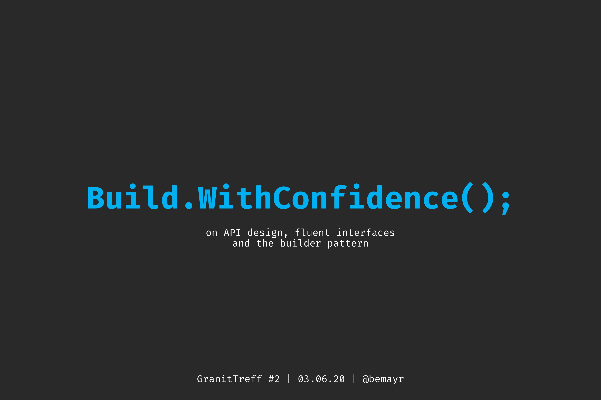

<h1 align="center">`Build.WithConfidence();`</h1>

  on API design, fluent interfaces and the builder pattern

 

> Materials for my talk about API design, fluent interfaces, the builder pattern and [Statecharts.NET](https://github.com/bemayr/Statecharts.NET/).

## Slides
The slides are available [`here`](./slides.pdf).

## Presentations
- *03.06.2020:* [GranitTreff #2]() [:movie_camera:](coming soon)
